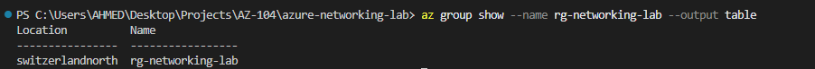
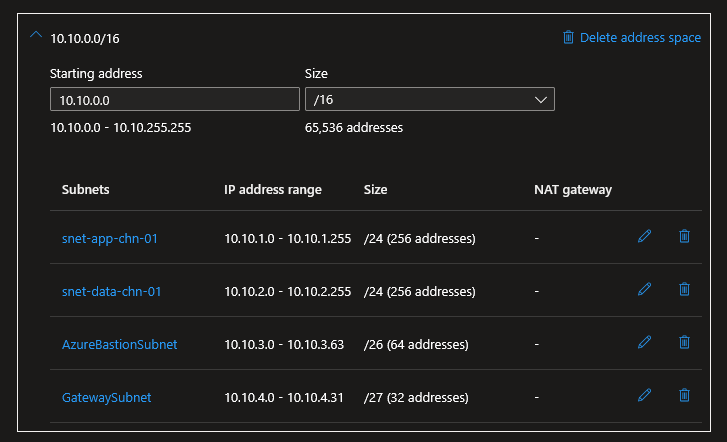
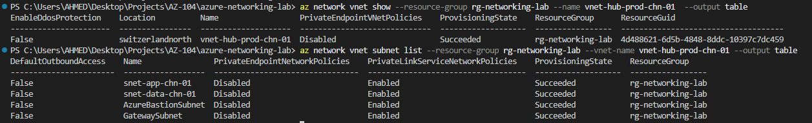

# Step 1: VNet & Subnet Design

## Overview
This step establishes the network foundation for the entire lab: a hub Virtual Network with properly segmented subnets, following CAF naming and IP address planning best practices. Reserved subnets for later steps (Bastion, VPN Gateway) are pre-planned now to avoid re-addressing a live VNet.

## 1. Resource Group

**Portal:**
1. Resource groups -> + Create
2. Name: `rg-networking-lab`
3. Region: Switzerland North
4. Review + Create

**CLI verification:**
```bash
az group show --name rg-networking-lab --output table
```



> 💡 **Technical Know-How:** A resource group is a logical container with no inherent regional restriction on its contents, but aligning the RG region with resource regions simplifies lifecycle management and is an AZ-104 best practice.

## 2. IP Address Planning

| VNet | Address Space | Purpose |
|---|---|---|
| vnet-hub-prod-chn-01 | 10.10.0.0/16 | Hub network for this lab (65,536 addresses) |

| Subnet | Address Range | Size | Purpose |
|---|---|---|---|
| snet-app-chn-01 | 10.10.1.0/24 | 256 addresses | Application tier |
| snet-data-chn-01 | 10.10.2.0/24 | 256 addresses | Data tier |
| AzureBastionSubnet | 10.10.3.0/26 | 64 addresses | Reserved for Step 10 (Bastion) |
| GatewaySubnet | 10.10.4.0/27 | 32 addresses | Reserved for Step 8 (VPN Gateway) |

> 💡 **Technical Know-How:** `AzureBastionSubnet` and `GatewaySubnet` are reserved subnet names required by Azure — they must be spelled exactly this way (case-sensitive, no hyphens) and cannot host other resources. Planning them upfront avoids costly re-addressing once workloads are live.

## 3. Create the Virtual Network and Subnets

**Portal:**
1. Virtual networks -> + Create
2. Resource group: `rg-networking-lab`
3. Name: `vnet-hub-prod-chn-01`
4. Region: Switzerland North
5. IPv4 address space: `10.10.0.0/16`
6. Subnets added: `snet-app-chn-01`, `snet-data-chn-01`, `AzureBastionSubnet`, `GatewaySubnet` (as per table above)
7. Review + Create



**CLI (equivalent approach for reference):**
```bash
az network vnet create \
  --resource-group rg-networking-lab \
  --name vnet-hub-prod-chn-01 \
  --address-prefix 10.10.0.0/16 \
  --subnet-name snet-app-chn-01 \
  --subnet-prefix 10.10.1.0/24

az network vnet subnet create \
  --resource-group rg-networking-lab \
  --vnet-name vnet-hub-prod-chn-01 \
  --name snet-data-chn-01 \
  --address-prefix 10.10.2.0/24

az network vnet subnet create \
  --resource-group rg-networking-lab \
  --vnet-name vnet-hub-prod-chn-01 \
  --name AzureBastionSubnet \
  --address-prefix 10.10.3.0/26

az network vnet subnet create \
  --resource-group rg-networking-lab \
  --vnet-name vnet-hub-prod-chn-01 \
  --name GatewaySubnet \
  --address-prefix 10.10.4.0/27
```

## 4. Verification

```bash
az network vnet show \
  --resource-group rg-networking-lab \
  --name vnet-hub-prod-chn-01 \
  --output table

az network vnet subnet list \
  --resource-group rg-networking-lab \
  --vnet-name vnet-hub-prod-chn-01 \
  --output table
```



## Key Learnings
- CAF naming convention applied consistently: `<resource-type>-<workload>-<env>-<region>-<instance>`
- IP address space planned upfront (10.10.0.0/16) to prevent overlap with future peered VNets in Step 2
- Reserved subnet names (`GatewaySubnet`, `AzureBastionSubnet`) pre-created now to avoid re-addressing a live VNet later
- No billable resources deployed in this step — VNets and subnets are free of charge