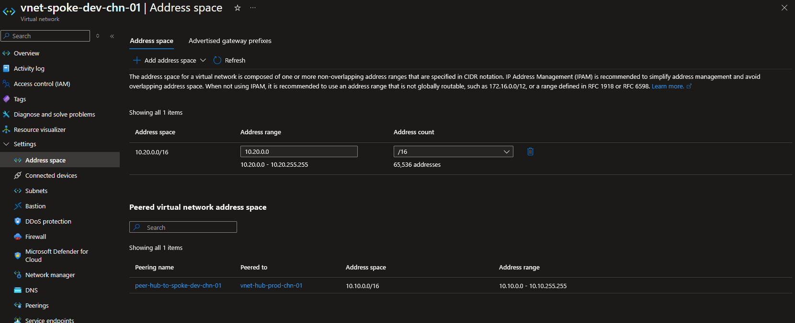
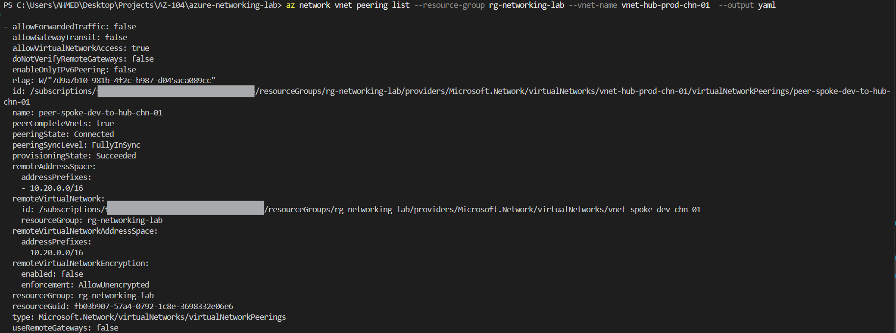

# Step 2: VNet Peering

## Overview
This step connects the hub VNet (`vnet-hub-prod-chn-01`, from Step 1) to a new spoke VNet using VNet Peering — the foundational building block of Azure's hub-and-spoke network architecture. Peering enables private, low-latency communication between VNets over Microsoft's backbone, without traversing the public internet.

## Core Concept

VNet Peering connects two Virtual Networks so resources communicate using **private IP addresses only**. Key characteristics:

- **Hub-and-spoke pattern**: A central hub VNet (shared services) peers with multiple spoke VNets (workloads) — the most common enterprise network topology in Azure.
- **Non-transitive by default**: If Hub peers with Spoke A and Spoke B, Spoke A **cannot** reach Spoke B automatically. Transitive routing requires additional components (NVA/firewall in the hub, or Azure Virtual WAN).
- **Two-sided link**: Peering is created as two separate link objects — one per VNet — because each side must explicitly consent. Both links must show status **Connected** for the peering to be functional.
- **Non-overlapping address spaces required**: Peering fails to establish if the two VNets' address spaces overlap.
- **Cost**: Peering itself is effectively free; only data transfer is billed (fractions of a cent per GB) — negligible for lab purposes.

## 1. Create the Spoke VNet

**Portal:**
1. Virtual networks -> + Create
2. Resource group: `rg-networking-lab`
3. Name: `vnet-spoke-dev-chn-01`
4. Region: Switzerland North
5. IPv4 address space: `10.20.0.0/16` (non-overlapping with hub's `10.10.0.0/16`)
6. Subnet: `snet-workload-chn-01` → `10.20.1.0/24`
7. Review + Create



**CLI verification:**
```bash
az network vnet show \
  --resource-group rg-networking-lab \
  --name vnet-spoke-dev-chn-01 \
  --output table
```

> 💡 **Technical Know-How:** Non-overlapping address spaces aren't just good practice — they're a hard technical requirement. Azure blocks peering creation entirely if ranges overlap. Planning IP space upfront (Step 1) avoids rework here.

## 2. Create the Peering (Hub ↔ Spoke)

**Portal:**
1. `vnet-hub-prod-chn-01` -> Peerings -> + Add
2. Local link name: `peer-hub-to-spoke-dev-chn-01`
3. Remote virtual network: `vnet-spoke-dev-chn-01`
4. Remote link name: `peer-spoke-dev-to-hub-chn-01`
5. Gateway transit / forwarded traffic left at defaults
6. Add

**CLI equivalent:**
```bash
# Hub -> Spoke
az network vnet peering create \
  --name peer-hub-to-spoke-dev-chn-01 \
  --resource-group rg-networking-lab \
  --vnet-name vnet-hub-prod-chn-01 \
  --remote-vnet vnet-spoke-dev-chn-01 \
  --allow-vnet-access true

# Spoke -> Hub
az network vnet peering create \
  --name peer-spoke-dev-to-hub-chn-01 \
  --resource-group rg-networking-lab \
  --vnet-name vnet-spoke-dev-chn-01 \
  --remote-vnet vnet-hub-prod-chn-01 \
  --allow-vnet-access true
```


## 3. Verification

```bash
az network vnet peering list \
  --resource-group rg-networking-lab \
  --vnet-name vnet-hub-prod-chn-01 \
  --output yaml
```

> 💡 **Technical Know-How:** Table output can truncate or misalign longer peering names and nested properties. YAML output preserves full field values and is often more readable for verifying peering state, provisioning state, and remote VNet references in one pass.



Confirm `peeringState: Connected` on both peering links.

## Key Learnings
- Peering requires two link objects (one per VNet direction) — both must independently show "Connected"
- Peering is non-transitive by default; this is a common exam trap when hub-and-spoke topologies expand beyond two VNets
- Non-overlapping IP address spaces are mandatory, not optional — validated this by reusing the Step 1 IP plan
- YAML CLI output proved more readable than table format for peering objects with longer names and nested properties
- No costly resources deployed — peering and data transfer for testing purposes are negligible in cost