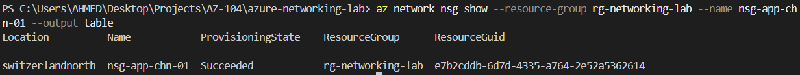
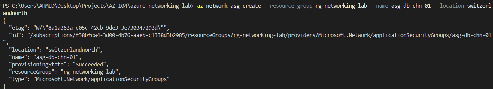
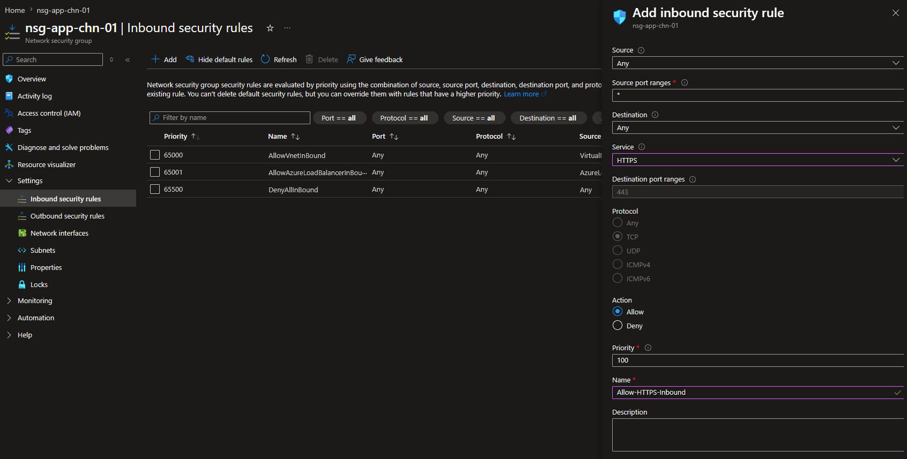
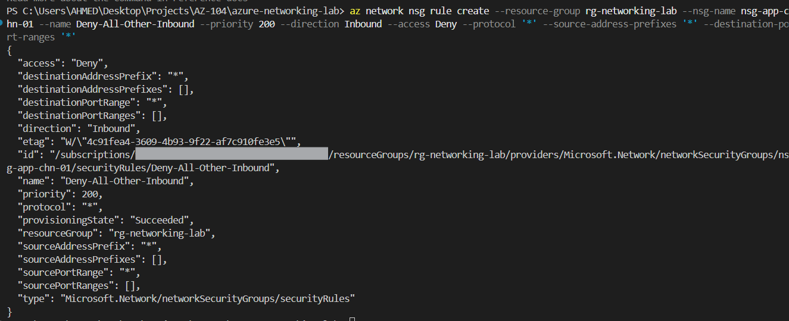
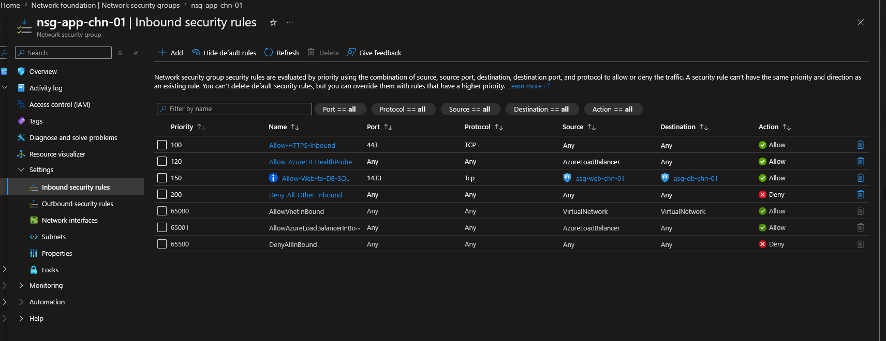
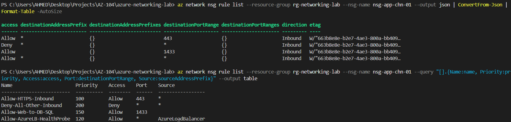

# Step 3: Network Security Groups & ASGs

## Overview
This step implements traffic filtering on the application subnet using a Network Security Group, and demonstrates Application Security Groups as a logical, membership-based alternative to hardcoding IP addresses in security rules.

## Core Concept

**NSGs** are stateful firewalls evaluated by priority (100–4096, lower = evaluated first). The first matching rule wins; evaluation stops there. Every NSG ships with immutable default rules (priority 65000–65500) — including `AllowVnetInBound`, `AllowAzureLoadBalancerInBound`, and `DenyAllInBound` — which cannot be edited, reprioritized, or deleted. Custom rules always evaluate before defaults, which means a broad custom Deny rule can unintentionally override a default Allow (see Key Learnings).

An NSG can attach to a **subnet**, a **NIC**, or both — if both, traffic must pass both to be allowed.

**ASGs** group NICs logically (e.g. "web tier") so NSG rules can reference the group instead of hardcoded IPs. Rules stay valid as VMs/NICs are added or removed, and read like architecture documentation rather than IP lists. Critically, an ASG must have at least one NIC member before it can be referenced in an NSG rule — an empty ASG is rejected at rule-creation time.

## 1. Create the NSG

**Portal:** Network security groups -> + Create -> `nsg-app-chn-01` -> `rg-networking-lab` -> Switzerland North

**CLI verification:**
```bash
az network nsg show \
  --resource-group rg-networking-lab \
  --name nsg-app-chn-01 \
  --output table
```


## 2. Create Application Security Groups

**Portal:** Application security groups -> + Create -> `asg-web-chn-01` and `asg-db-chn-01`

**CLI:**
```bash
az network asg create --resource-group rg-networking-lab --name asg-web-chn-01 --location switzerlandnorth
az network asg create --resource-group rg-networking-lab --name asg-db-chn-01 --location switzerlandnorth
```


## 3. Create Standalone NICs and Assign ASG Membership

Since ASGs require an actual member before being usable in a rule, two standalone (VM-less) NICs were created to demonstrate real ASG membership without deploying costly compute resources.

```bash
az network nic create \
  --resource-group rg-networking-lab \
  --name nic-web-demo-chn-01 \
  --vnet-name vnet-hub-prod-chn-01 \
  --subnet snet-app-chn-01 \
  --application-security-groups asg-web-chn-01

az network nic create \
  --resource-group rg-networking-lab \
  --name nic-db-demo-chn-01 \
  --vnet-name vnet-hub-prod-chn-01 \
  --subnet snet-data-chn-01 \
  --application-security-groups asg-db-chn-01
```

> 💡 **Technical Know-How:** ASG membership lives on the NIC's **IP configuration** object, not the NIC resource itself. The default IP config name can vary (`ipconfig1` vs. `Ipv4config`, depending on Portal version) — always confirm the actual name with `az network nic ip-config list` before referencing it in an update command.

## 4. Create NSG Rules

Rules were built in the following priority order — deliberately including a mid-priority ASG rule to reason through evaluation order.

| Priority | Rule Name | Purpose |
|---|---|---|
| 100 | Allow-HTTPS-Inbound | Public web traffic |
| 120 | Allow-AzureLB-HealthProbe | Preserves Load Balancer health checks (required for Step 6) |
| 150 | Allow-Web-to-DB-SQL | ASG-to-ASG, internal only, port 1433 |
| 200 | Deny-All-Other-Inbound | Explicit deny, catch-all |

**Portal:** `nsg-app-chn-01` -> Inbound security rules -> + Add (per rule above)


**CLI:**
```bash
az network nsg rule create \
  --resource-group rg-networking-lab --nsg-name nsg-app-chn-01 \
  --name Allow-HTTPS-Inbound --priority 100 \
  --direction Inbound --access Allow --protocol Tcp \
  --source-address-prefixes '*' --destination-port-ranges 443

az network nsg rule create \
  --resource-group rg-networking-lab --nsg-name nsg-app-chn-01 \
  --name Allow-AzureLB-HealthProbe --priority 120 \
  --direction Inbound --access Allow --protocol '*' \
  --source-address-prefixes AzureLoadBalancer --destination-port-ranges '*'

az network nsg rule create \
  --resource-group rg-networking-lab --nsg-name nsg-app-chn-01 \
  --name Allow-Web-to-DB-SQL --priority 150 \
  --direction Inbound --access Allow --protocol Tcp \
  --source-asgs asg-web-chn-01 --destination-asgs asg-db-chn-01 \
  --destination-port-ranges 1433

az network nsg rule create \
  --resource-group rg-networking-lab --nsg-name nsg-app-chn-01 \
  --name Deny-All-Other-Inbound --priority 200 \
  --direction Inbound --access Deny --protocol '*' \
  --source-address-prefixes '*' --destination-port-ranges '*'
```


## 5. Associate NSG with Subnet

```bash
az network vnet subnet update \
  --resource-group rg-networking-lab \
  --vnet-name vnet-hub-prod-chn-01 \
  --name snet-app-chn-01 \
  --network-security-group nsg-app-chn-01
```

## 6. Verification

**Portal:**


**CLI** (two approaches used for readability, since default `--output table` truncated/misaligned some fields):
```bash
az network nsg rule list \
  --resource-group rg-networking-lab \
  --nsg-name nsg-app-chn-01 \
  --output json | ConvertFrom-Json | Format-Table -AutoSize

az network nsg rule list \
  --resource-group rg-networking-lab \
  --nsg-name nsg-app-chn-01 \
  --query "[].{Name:name, Priority:priority, Access:access, Port:destinationPortRange, Source:sourceAddressPrefix}" \
  --output table
```


> 💡 **Technical Know-How:** Piping JSON output through PowerShell's `ConvertFrom-Json | Format-Table -AutoSize` handles complex/nested fields more reliably than Azure CLI's native `--output table`, which can truncate or misalign columns for objects with many properties (as seen with NSG rules referencing ASGs).

## Errors Encountered & Resolved

**1. ASG rule creation failed initially:**
`Rules using application security groups may only be applied when the ASGs are associated with network interfaces on the same virtual network.`
-> Root cause: ASGs were empty (no NIC members). Azure rejects ASG references in rules until the ASG has at least one member. Resolved by creating standalone NICs and assigning ASG membership via their IP configuration before retrying the rule.

**2. Deny-All rule triggered a Load Balancer warning:**
`This rule denies traffic from AzureLoadBalancer and may affect virtual machine connectivity.`
-> Root cause: the default rule `AllowAzureLoadBalancerInBound` (priority 65001) is immutable and cannot be reprioritized — a custom Deny-All at priority 200 would evaluate first and silently block LB health probes. Resolved by adding an explicit `Allow-AzureLB-HealthProbe` rule at priority 120 (evaluated before the deny), preserving Load Balancer functionality ahead of Step 6.

## Key Learnings
- Default NSG rules (priority 65000+) are immutable — conflicts must be resolved with new custom rules at lower priority numbers, not by editing defaults
- ASGs require at least one NIC member before they can be referenced in an NSG rule — membership lives on the NIC's IP configuration, not the NIC itself
- A catch-all Deny-All rule can silently break platform functionality (like Load Balancer health probes) if it sits above the relevant Allow rule — always map out priority order against *all* traffic types before adding a broad deny
- Standalone NICs (no attached VM) are a cost-free way to test ASG membership and NSG rule logic without deploying compute
- PowerShell JSON piping is more reliable than `--output table` for CLI verification of complex NSG rule sets