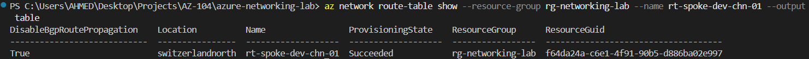
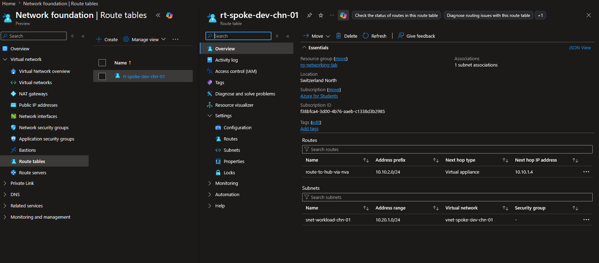
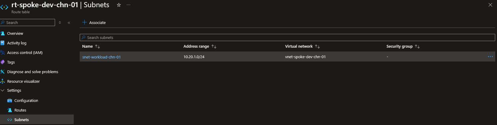
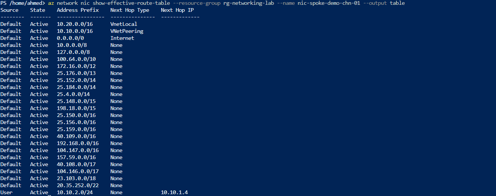
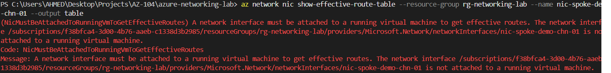

# Step 4: Route Tables & UDRs

## Overview
This step introduces User-Defined Routes (UDRs) to override Azure's default system routing, simulating a forced-tunneling pattern where traffic between subnets is directed through a virtual appliance (e.g. a firewall/NVA) instead of taking the default system path.

## Core Concept

Every subnet has a **system route table** by default (VNet-local routes, peered VNet routes, and a default `0.0.0.0/0` -> Internet route). A **Route Table** resource with custom routes (UDRs) can override these.

- **Forced tunneling**: routing traffic through a central NVA/firewall for inspection instead of allowing direct paths — the standard way hub-and-spoke architectures enforce security policy beyond simple connectivity.
- **Route selection logic**: Azure applies **longest prefix match** first; when prefixes are equally specific, the priority order is **UDR > BGP route > System route**.
- **Next hop types**: `Virtual Network Gateway`, `Virtual Network`, `Internet`, `Virtual Appliance` (NVA private IP), `None` (blackhole/drop).

## 1. Create the Route Table

**Portal:** Route tables -> + Create -> `rt-spoke-dev-chn-01` -> `rg-networking-lab` -> Switzerland North -> Propagate gateway routes: **No**

**CLI verification:**
```bash
az network route-table show \
  --resource-group rg-networking-lab \
  --name rt-spoke-dev-chn-01 \
  --output table
```


## 2. Add Custom Route

**Portal:** `rt-spoke-dev-chn-01` -> Routes -> + Add
- Name: `route-to-hub-via-nva`
- Destination: `10.10.2.0/24` (hub's data subnet)
- Next hop type: Virtual appliance
- Next hop address: `10.10.1.4` (demo NIC from Step 3, standing in for a firewall/NVA)



**CLI:**
```bash
az network route-table route create \
  --resource-group rg-networking-lab \
  --route-table-name rt-spoke-dev-chn-01 \
  --name route-to-hub-via-nva \
  --address-prefix 10.10.2.0/24 \
  --next-hop-type VirtualAppliance \
  --next-hop-ip-address 10.10.1.4
```

## 3. Associate Route Table with Spoke Subnet

**Portal:** `rt-spoke-dev-chn-01` -> Subnets -> + Associate -> `vnet-spoke-dev-chn-01` / `snet-workload-chn-01`



**CLI:**
```bash
az network vnet subnet update \
  --resource-group rg-networking-lab \
  --vnet-name vnet-spoke-dev-chn-01 \
  --name snet-workload-chn-01 \
  --route-table rt-spoke-dev-chn-01
```

## 4. Verify Effective Routes

Effective routes merge system routes, BGP routes, and UDRs into the actual routing decision Azure will make — the primary diagnostic command for "why is traffic taking the wrong path."

```bash
az network nic create \
  --resource-group rg-networking-lab \
  --name nic-spoke-demo-chn-01 \
  --vnet-name vnet-spoke-dev-chn-01 \
  --subnet snet-workload-chn-01

az network nic show-effective-route-table \
  --resource-group rg-networking-lab \
  --name nic-spoke-demo-chn-01 \
  --output table
```



## Error Encountered & Resolved

**Error:** `Azure cannot calculate or generate the active, effective route table for a network interface (NIC) unless the virtual machine it is attached to is currently running (in the VM running state).`



**Root cause:** Effective route computation is a live routing-engine calculation — it requires an active compute resource attached to the NIC. A standalone NIC (no VM) has no traffic to route, so Azure has nothing to compute against.

**Resolution:** Deployed a minimal, low-cost VM (`Standard_B2ats_v2`, Ubuntu 22.04) attached to the existing NIC purely to activate route computation, ran the effective-routes query, then deleted the VM immediately — following the deploy-verify-delete cost pattern.

```bash
az vm create \
  --resource-group rg-networking-lab \
  --name vm-spoke-demo \
  --nics nic-spoke-demo-chn-01 \
  --image Ubuntu2204 \
  --size Standard_B2ats_v2 \
  --admin-username azureuser \
  --generate-ssh-keys

az network nic show-effective-route-table \
  --resource-group rg-networking-lab \
  --name nic-spoke-demo-chn-01 \
  --output table

az vm delete --resource-group rg-networking-lab --name vm-spoke-demo --yes --no-wait
```

> 💡 **Technical Know-How:** Deleting a VM with `az vm delete` does **not** delete its attached NIC by default — only the compute resource and (depending on flags) the OS disk. The NIC persists, which is why this pattern is reusable: spin up a minimal VM only when a live routing/NIC state is genuinely required, verify, then tear down — keeping the NIC and its configuration intact for future steps.

## Key Learnings
- UDRs override system routes using longest-prefix-match logic, with priority **UDR > BGP > System** when prefixes tie
- Route Tables are free; the only cost in this step came from a briefly-running VM used solely to unlock live route computation
- Effective route computation requires an active (running) VM attached to the NIC — a purely standalone NIC cannot be queried this way, unlike NSG/ASG association which works on standalone NICs (Step 3)
- Deploy-verify-delete pattern applies not just to expensive resources (Step 7, 8) but to any VM needed briefly for diagnostic purposes
- Deleting a VM does not delete its attached NIC — useful for reusing network configuration across verification steps