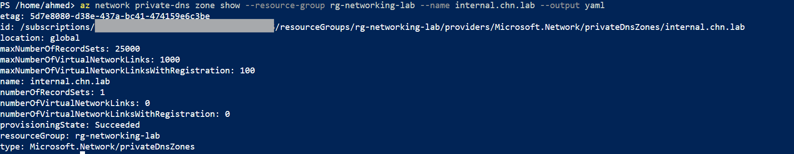
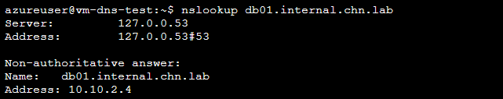

# Step 5: Azure DNS

## Overview
This step implements a Private DNS zone for internal name resolution across the hub and spoke VNets, demonstrating how Azure Private DNS decouples hostname references from hardcoded IP addresses — and proving live resolution end-to-end from inside a VNet.

## Core Concept

**Public vs Private DNS zones:** Public zones resolve names from the internet (Azure as authoritative name server for a domain). Private zones resolve names **only within linked VNets**, never exposed externally — the foundation for internal service discovery and private endpoint resolution.

Key mechanics:
- **VNet linking is mandatory and separate from zone creation.** Creating a zone alone does nothing — a resource in a VNet only resolves records in a zone if that VNet has an explicit **virtual network link** to it. This is one of the most commonly missed steps in real deployments.
- **Auto-registration** (optional, per-link): automatically creates/removes A records for VMs as they're deployed/deleted in that VNet — no manual DNS management needed.
- **Peering does not imply DNS resolution.** Two peered VNets (Step 2) do not automatically share DNS resolution — both must be linked to the same Private DNS zone (or use Azure DNS Private Resolver, out of scope here) for cross-VNet name resolution to work.
- **Split-horizon DNS** is possible: a public and private zone can share the same domain name, returning different answers depending on query origin (internal vs external).

## 1. Create the Private DNS Zone

**Portal:** Private DNS zones -> + Create -> `internal.chn.lab` -> `rg-networking-lab`

**CLI verification:**
```bash
az network private-dns zone show \
  --resource-group rg-networking-lab \
  --name internal.chn.lab \
  --output yaml
```


## 2. Link the Zone to Both VNets

**Portal:** `internal.chn.lab` -> Virtual network links -> + Add
- `link-hub-chn-01` -> `vnet-hub-prod-chn-01`, auto-registration enabled
- `link-spoke-chn-01` -> `vnet-spoke-dev-chn-01`, auto-registration disabled

**CLI:**
```bash
az network private-dns link vnet create \
  --resource-group rg-networking-lab \
  --zone-name internal.chn.lab \
  --name link-hub-chn-01 \
  --virtual-network vnet-hub-prod-chn-01 \
  --registration-enabled true

az network private-dns link vnet create \
  --resource-group rg-networking-lab \
  --zone-name internal.chn.lab \
  --name link-spoke-chn-01 \
  --virtual-network vnet-spoke-dev-chn-01 \
  --registration-enabled false
```

## 3. Add a Manual A Record

**Portal:** `internal.chn.lab` -> Record set -> + Add -> `db01` -> A -> `10.10.2.4` (Step 3's `nic-db-demo-chn-01`)

**CLI:**
```bash
az network private-dns record-set a add-record \
  --resource-group rg-networking-lab \
  --zone-name internal.chn.lab \
  --record-set-name db01 \
  --ipv4-address 10.10.2.4
```

## 4. Verify Live Resolution

To prove resolution works end-to-end (not just that the configuration exists), a temporary low-cost VM was deployed into the hub subnet, tested via Azure Serial Console, and deleted immediately after.

```bash
az vm create \
  --resource-group rg-networking-lab \
  --name vm-dns-test \
  --vnet-name vnet-hub-prod-chn-01 \
  --subnet snet-app-chn-01 \
  --nsg "" \
  --image Ubuntu2204 \
  --size Standard_B2ats_v2 \
  --admin-username azureuser \
  --generate-ssh-keys \
  --public-ip-address ""
```

**Serial Console access required a local password**, set via:
```bash
az vm user update \
  --resource-group rg-networking-lab \
  --name vm-dns-test \
  --username azureuser \
  --password "LabPass2026!"
```

Resolution test from inside the VM:
```bash
nslookup db01.internal.chn.lab
```


Result: `db01.internal.chn.lab` resolved to `10.10.2.4` via Azure's internal DNS service (`127.0.0.53` local stub resolver -> Azure DNS `168.63.129.16`), confirming the zone, link, and record are all functioning correctly end-to-end.

VM deleted immediately after verification:
```bash
az vm delete --resource-group rg-networking-lab --name vm-dns-test --yes --no-wait
```

## Error Encountered & Resolved

**Issue:** Azure Serial Console requires an interactive `login:` prompt (username + password) — it behaves exactly like a physical monitor/keyboard attached to the server and cannot accept an SSH private key file, even though the VM was created with `--generate-ssh-keys`.

**Root cause:** Standard Ubuntu cloud images on Azure disable password authentication by default and only accept SSH key-based login — but Serial Console has no mechanism to pass a key file, since it's not an SSH session.

**Resolution:** Set a local password for the VM's admin user via `az vm user update --password`, allowing Serial Console login without altering the VM's SSH configuration.

> 💡 **Technical Know-How:** `az vm user update` can set/reset a user's password on a running VM without needing console access or redeployment — useful not just for Serial Console access but as a general recovery method if SSH key access is ever lost.

## Key Learnings
- Creating a Private DNS zone has no effect until it's explicitly linked to a VNet — this is the step most commonly missed in real deployments
- Peering (Step 2) does not grant DNS resolution across VNets by itself; both VNets need a link to the same Private DNS zone
- Auto-registration is a per-link toggle, allowing different behavior per VNet within the same zone
- Azure Serial Console requires password authentication — SSH keys alone are insufficient for console access, a gotcha worth knowing before an emergency access scenario
- `nslookup` from inside a linked VNet is the definitive way to prove private DNS resolution is functioning, beyond just checking that records/links exist in the Portal or CLI