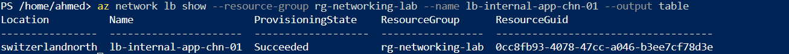
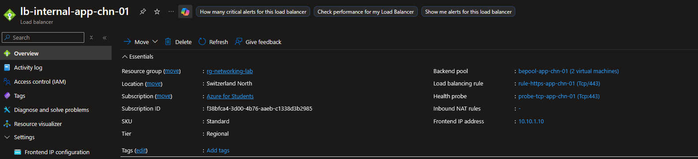
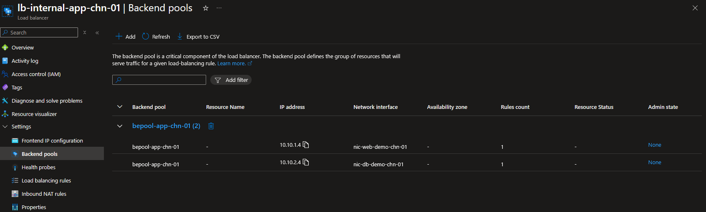
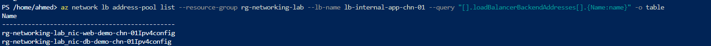
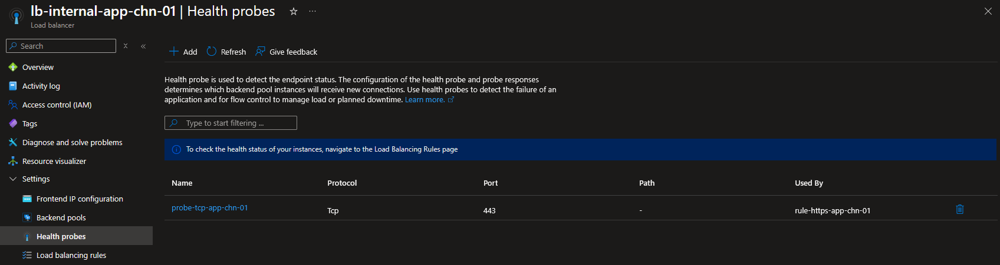
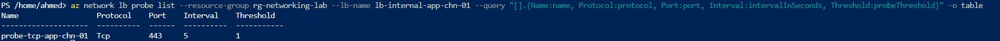
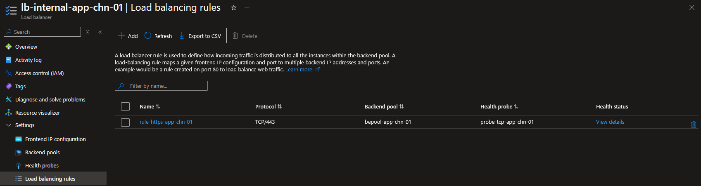
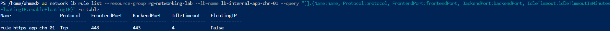
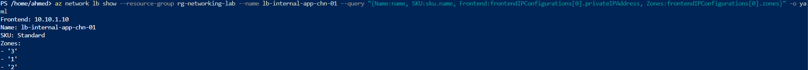

# Step 6: Load Balancer

## Overview
This step deploys an **Internal Standard Load Balancer** distributing traffic across existing demo NICs, using a private static frontend IP, a TCP health probe, and a load balancing rule. As of this step, Basic Load Balancer is no longer usable in Azure — Standard SKU is now mandatory, which changes this step's cost profile from free to deploy-verify-delete.

## Core Concept

A Load Balancer distributes inbound traffic across backend resources based on rules, keeping any single instance from being overwhelmed and removing unhealthy instances from rotation automatically.

**Core building blocks:**
- **Frontend IP configuration** — the entry point; public (internet-facing) or internal (private IP only)
- **Backend pool** — the group of VMs/NICs receiving distributed traffic
- **Health probe** — periodically checks each backend instance; failing instances are automatically removed from rotation. This is exactly why the `Allow-AzureLB-HealthProbe` NSG rule was created in Step 3 — probes originate from Azure infrastructure and must be explicitly allowed through any restrictive NSG
- **Load balancing rule** — ties frontend IP + port to backend pool + port, governed by a health probe

**Public vs Internal LB:** Public LB exposes a public frontend IP; Internal LB uses only a private frontend IP for traffic between application tiers, never exposed externally. An Internal LB was chosen here — it avoids a Public IP cost and reflects the more common enterprise pattern (e.g., app tier -> data tier traffic).

**⚠️ Basic SKU retirement:** Basic Load Balancer could no longer be created as of March 31, 2025, and was fully retired on September 30, 2025. Standard SKU is now the only option for new deployments — meaning this step now incurs hourly billing (unlike NSGs, route tables, or DNS zones), requiring the same deploy-verify-delete discipline used for higher-cost resources like Application Gateway and VPN Gateway.

## 1. Create the Load Balancer

**Portal:** Load balancers -> + Create
- Name: `lb-internal-app-chn-01`
- Region: Switzerland North
- SKU: **Standard** (only available option)
- Type: **Internal**
- Frontend IP: `feip-app-chn-01`, VNet `vnet-hub-prod-chn-01`, subnet `snet-app-chn-01`, static IP `10.10.1.10`

> 💡 **Technical Know-How:** A static private frontend IP was used deliberately — internal load balancers in production should have predictable addresses, since downstream DNS records (like the `db01` A record from Step 5) point to fixed IPs, not dynamically assigned ones.

**CLI verification:**
```bash
az network lb show \
  --resource-group rg-networking-lab \
  --name lb-internal-app-chn-01 \
  --output table
```



## 2. Backend Pool

**Portal:** `lb-internal-app-chn-01` -> Backend pools -> + Add -> `bepool-app-chn-01`



**CLI (required — see Error section below):**
```bash
az network lb address-pool create \
  --resource-group rg-networking-lab \
  --lb-name lb-internal-app-chn-01 \
  --name bepool-app-chn-01
```

Existing standalone NICs from Steps 3–4 were added to the pool via CLI, since Standard Load Balancer's Portal backend pool picker only lists NICs attached to a running VM — standalone NICs are not selectable there:

```bash
az network nic ip-config address-pool add \
  --resource-group rg-networking-lab \
  --nic-name nic-web-demo-chn-01 \
  --ip-config-name Ipv4config \
  --lb-name lb-internal-app-chn-01 \
  --address-pool bepool-app-chn-01

az network nic ip-config address-pool add \
  --resource-group rg-networking-lab \
  --nic-name nic-db-demo-chn-01 \
  --ip-config-name Ipv4config \
  --lb-name lb-internal-app-chn-01 \
  --address-pool bepool-app-chn-01
```

**Verification:**
```bash
az network lb address-pool list \
  --resource-group rg-networking-lab \
  --lb-name lb-internal-app-chn-01 \
  --query "[].loadBalancerBackendAddresses[].{Name:name}" \
  --output table
```


## 3. Health Probe

**Portal:** Health probes -> + Add
- Name: `probe-tcp-app-chn-01`, Protocol: TCP, Port: `443`, Interval: 5s



**CLI:**
```bash
az network lb probe create \
  --resource-group rg-networking-lab \
  --lb-name lb-internal-app-chn-01 \
  --name probe-tcp-app-chn-01 \
  --protocol Tcp \
  --port 443 \
  --interval 5
```

Verification:
```bash
az network lb probe list \
  --resource-group rg-networking-lab \
  --lb-name lb-internal-app-chn-01 \
  --query "[].{Name:name, Protocol:protocol, Port:port, Interval:intervalInSeconds, Threshold:probeThreshold}" \
  --output table
```


## 4. Load Balancing Rule

**Portal:** Load balancing rules -> + Add
- Name: `rule-https-app-chn-01`, Frontend: `feip-app-chn-01`, Backend pool: `bepool-app-chn-01`, Probe: `probe-tcp-app-chn-01`, Port 443 -> 443



**CLI:**
```bash
az network lb rule create \
  --resource-group rg-networking-lab \
  --lb-name lb-internal-app-chn-01 \
  --name rule-https-app-chn-01 \
  --protocol Tcp \
  --frontend-port 443 \
  --backend-port 443 \
  --frontend-ip-name feip-app-chn-01 \
  --backend-pool-name bepool-app-chn-01 \
  --probe-name probe-tcp-app-chn-01
```

Verification:
```bash
az network lb rule list \
  --resource-group rg-networking-lab \
  --lb-name lb-internal-app-chn-01 \
  --query "[].{Name:name, Protocol:protocol, FrontendPort:frontendPort, BackendPort:backendPort, IdleTimeout:idleTimeoutInMinutes, FloatingIP:enableFloatingIP}" \
  --output table
```


## 5. Full Configuration Summary

```bash
az network lb show \
  --resource-group rg-networking-lab \
  --name lb-internal-app-chn-01 \
  --query "{Name:name, SKU:sku.name, Frontend:frontendIPConfigurations[0].privateIPAddress, Zones:frontendIPConfigurations[0].zones}" \
  --output yaml
```


## 6. Teardown (cost control)

Standard Load Balancer is billed hourly — deleted immediately after documentation was complete, per the deploy-verify-delete pattern now required by the Basic SKU retirement:

```bash
az network lb delete \
  --resource-group rg-networking-lab \
  --name lb-internal-app-chn-01
```

## Error Encountered & Resolved

**Error:** `InvalidResourceReference` — the backend pool `bepool-app-chn-01` referenced in the NIC association command was reported as not found, even though it appeared to have been created in the Portal.

**Root cause:** The Portal's backend pool creation blade for a Standard Load Balancer only allows selecting NICs attached to a running VM (in this environment, only `vm-dns-test` qualified). Because the standalone demo NICs weren't selectable, the Portal step wasn't actually completed/saved as a real backend pool object — Portal UI state and actual deployed resource state were out of sync.

**Resolution:** Created the backend pool explicitly via CLI (`az network lb address-pool create`), which has no dependency on VM attachment, then associated the standalone NICs directly at the IP-configuration level.

> 💡 **Technical Know-How:** The Portal's Standard LB backend pool picker is VM-centric and does not support standalone NICs — a real limitation, not a display bug. CLI operates at the NIC/IP-configuration level directly and is the reliable path when working with NICs that have no attached VM (as has been the case throughout this lab for cost control).

## Key Learnings
- Basic Load Balancer is fully retired (September 30, 2025) — Standard SKU is now mandatory for any new deployment, which introduces hourly billing where previously this step could be built at no cost
- Health probes require the `AzureLoadBalancer` NSG allow rule built in Step 3 — without it, probes are silently blocked and all backend targets appear unhealthy
- The Portal's backend pool experience for Standard LB only supports VM-attached NICs; standalone NICs must be associated via CLI
- A Portal blade that appears complete may not have actually persisted a resource — always verify via CLI (`list`/`show`) rather than assuming the Portal state reflects deployed reality
- Static private frontend IPs are the correct choice for internal load balancers whose address is referenced elsewhere (e.g. DNS records)