# Step 7: Application Gateway

## Overview
This step deploys a Layer 7 (HTTP-aware) load balancer — Application Gateway — using the Standard_v2 SKU with path-based routing to existing demo backend targets. It also includes an extended backend-health investigation that uncovered two real, independent root causes layered on top of each other: the new Azure default-private-subnet behavior, and a misattached NSG. This was a genuinely billed-hourly resource, deployed, investigated, and deleted within a single extended session.

## Core Concept

**Application Gateway vs Load Balancer (Step 6):** Load Balancer operates at Layer 4 (TCP/UDP) with no visibility into HTTP content. Application Gateway operates at Layer 7 — it understands HTTP requests and can route based on URL path, hostname, headers, etc.

Key building blocks:
- **Listener**: the entry point — protocol, port, frontend IP, hostname (Basic vs Multi-site)
- **Backend pool**: target IPs/FQDNs/NICs receiving forwarded traffic — unlike Standard Load Balancer's Portal experience (Step 6), Application Gateway's backend pool accepts raw IP addresses directly, without requiring a VM attachment
- **HTTP settings**: defines how traffic is forwarded to the backend (port, protocol, cookie-based affinity, timeout)
- **Routing rule**: ties a listener to a backend pool (+ HTTP settings), with an explicit **priority** for evaluation order when multiple rules exist
- **SSL/TLS termination**: Application Gateway can decrypt HTTPS at the gateway and route based on content before re-encrypting or forwarding as HTTP to the backend
- **WAF tier** (`WAF_v2`): optional OWASP-based threat protection, not enabled in this lab to minimize cost
- **Autoscaling**: v2 SKU scales instance count automatically (0–125), replacing v1's fixed instance model entirely

**⚠️ Application Gateway V1 retirement:** V1 SKU was retired on April 28, 2026, and can no longer be deployed — V2 (Standard_v2 / WAF_v2) is now the only option for any new deployment. V2 was already the intended choice for this lab, so no strategy change was needed.

## 1. Dedicated Subnet

Application Gateway requires a subnet containing **only** Application Gateway resources — no other resource types are permitted alongside it.

```bash
az network vnet subnet create \
  --resource-group rg-networking-lab \
  --vnet-name vnet-hub-prod-chn-01 \
  --name snet-agw-chn-01 \
  --address-prefix 10.10.5.0/26
```
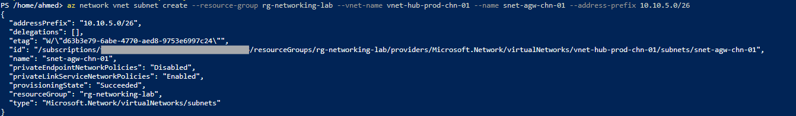

## 2. Public IP (Standard SKU required)

```bash
az network public-ip create \
  --resource-group rg-networking-lab \
  --name pip-agw-app-chn-01 \
  --sku Standard \
  --allocation-method Static \
  --location switzerlandnorth
```

## 3. Create Application Gateway

**Portal:** Application gateways -> + Create
- Name: `agw-app-chn-01`, Region: Switzerland North, Tier: **Standard V2**
- Autoscaling: Min `0`, Max `2`
- No availability zones
- VNet: `vnet-hub-prod-chn-01`, Subnet: `snet-agw-chn-01`

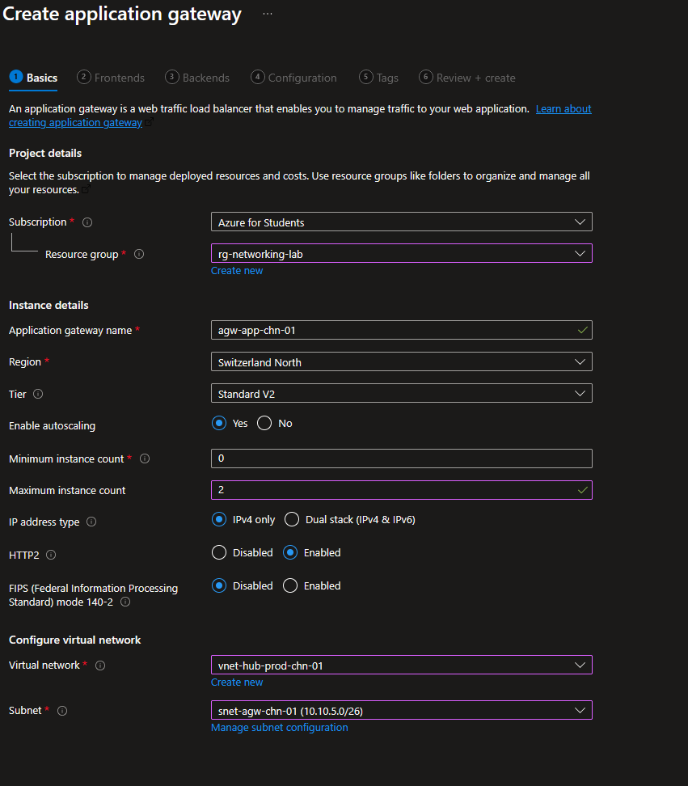

**Frontend:** Public, `pip-agw-app-chn-01`

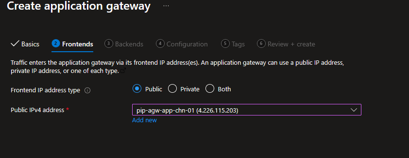

**Backend pool:** `bepool-agw-chn-01`, targets added by raw IP: `10.10.1.4`, `10.10.2.4` (existing demo NICs from Steps 3–4)

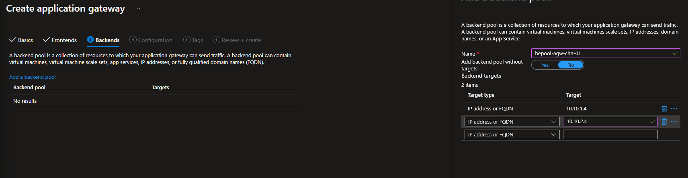

## 4. Routing Rule

- Rule name: `rule-http-chn-01`
- **Priority: `100`** (mandatory in Standard_v2, absent in the retired v1 SKU)
- **Listener name: `listener-http-chn-01`** (v2 listeners are named/managed objects)
- Frontend IP: Public IPv4, Protocol: HTTP, Port: `80`, Listener type: Basic

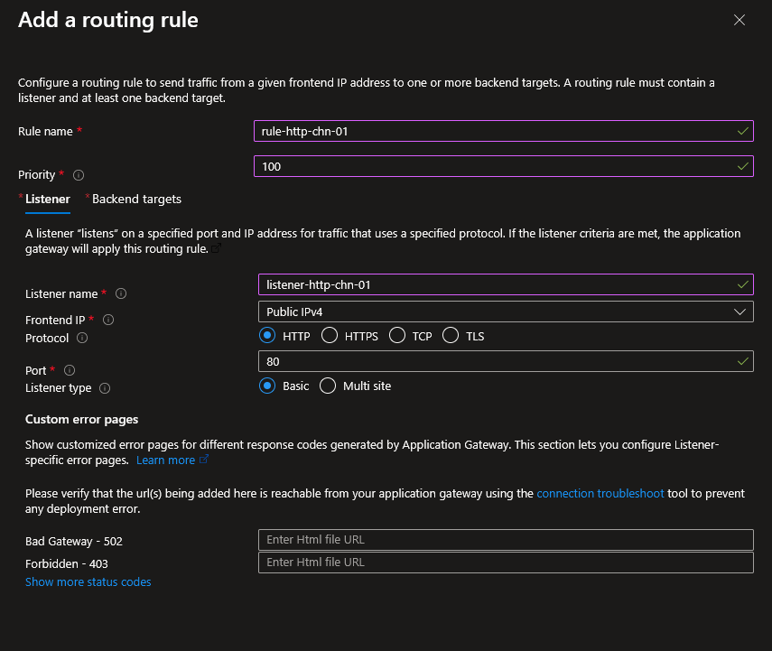

- Backend target: `bepool-agw-chn-01`, HTTP settings: `httpsettings-chn-01`, port 80, protocol HTTP, no cookie affinity

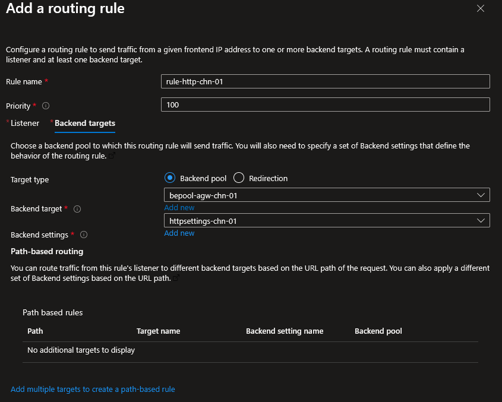

> 💡 **Technical Know-How:** Standard_v2 introduced mandatory rule **priority** and explicit **listener naming** as first-class fields, enabling multiple routing rules to coexist with defined evaluation order — the same principle already seen in NSG rule priority (Step 3).

## 5. Initial Verification

**Portal:**

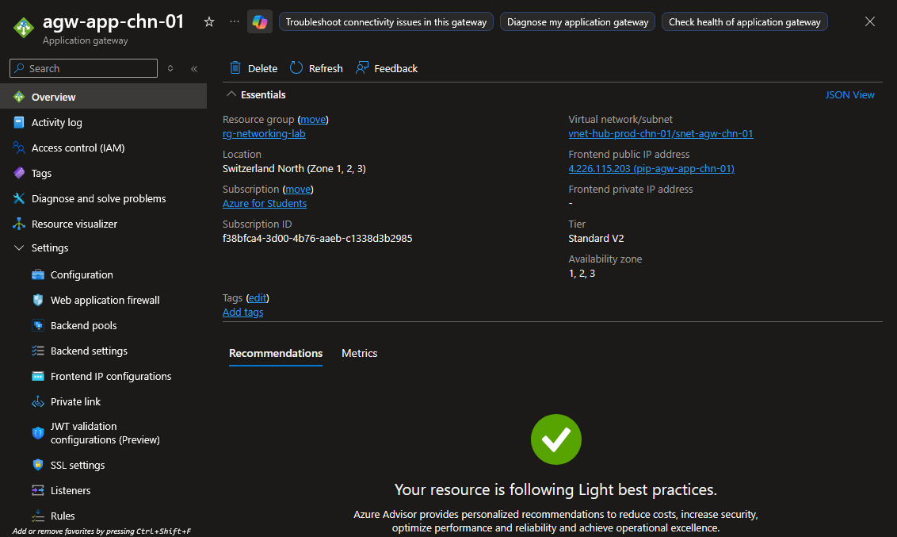

**CLI:**
```bash
az network application-gateway show \
  --resource-group rg-networking-lab \
  --name agw-app-chn-01 \
  --query "{Name:name, SKU:sku.name, Tier:sku.tier, ProvisioningState:provisioningState, FrontendIP:frontendIPConfigurations[0].publicIPAddress.id}" \
  --output yaml
```
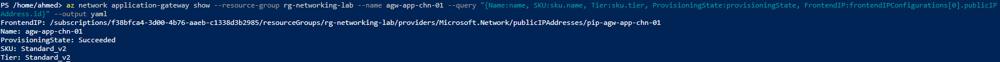

---

## Deep Dive: Backend Health Investigation

Immediately after deployment, both backend targets showed **Unhealthy** — expected, since neither NIC had a running VM or listening service:

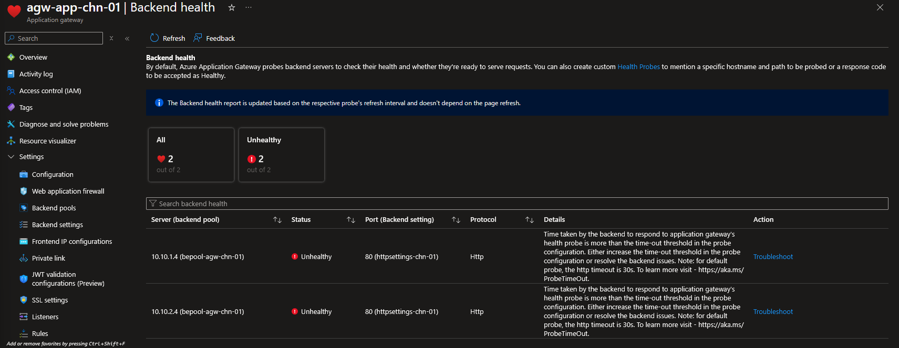

To prove the mechanism end-to-end, two temporary VMs with nginx were deployed onto the existing demo NICs, using a deliberate contrast: `10.10.1.4` sits behind `nsg-app-chn-01` (which blocks port 80), while `10.10.2.4` was believed to have no NSG at all.

```bash
az vm create \
  --resource-group rg-networking-lab \
  --name vm-db-demo \
  --nics nic-db-demo-chn-01 \
  --image Ubuntu2204 \
  --size Standard_B2ats_v2 \
  --admin-username azureuser \
  --generate-ssh-keys \
  --custom-data cloud-init-nginx.yaml

az vm create \
  --resource-group rg-networking-lab \
  --name vm-web-demo \
  --nics nic-web-demo-chn-01 \
  --image Ubuntu2204 \
  --size Standard_B2ats_v2 \
  --admin-username azureuser \
  --generate-ssh-keys \
  --custom-data cloud-init-nginx.yaml
```

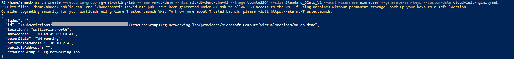
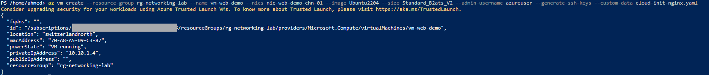

### Root Cause #1: Default outbound access is retired for new VNets

The cloud-init nginx install **failed on both VMs** with `apt-get` connection timeouts to `azure.archive.ubuntu.com`. Investigation confirmed that as of **March 31, 2026**, newly created Azure VNets default their subnets to **private** — meaning no implicit outbound internet access exists unless explicitly configured (NAT Gateway, Load Balancer outbound rule, or a Public IP on the NIC). Since this lab's VNet was created after that date, every VM deployed into it has been silently affected — this had simply never surfaced before, since no earlier step required outbound internet from a VM.

**Fix applied (temporary, scoped to one VM to unblock the investigation):**
```bash
az network public-ip create \
  --resource-group rg-networking-lab \
  --name pip-vm-db-demo-temp \
  --sku Standard \
  --allocation-method Static \
  --location switzerlandnorth

az network nic ip-config update \
  --resource-group rg-networking-lab \
  --nic-name nic-db-demo-chn-01 \
  --name Ipv4config \
  --public-ip-address pip-vm-db-demo-temp
```

nginx was then installed manually via Serial Console on `vm-db-demo` and confirmed locally reachable (`curl -I http://localhost:80` -> `200 OK`).

> 💡 **Technical Know-How:** This is one of the most significant recent Azure networking platform changes. The permanent, production-correct fix is a **NAT Gateway** on the subnet (planned for Step 10) rather than per-NIC Public IPs, which don't scale and reintroduce public exposure risk.

### Root Cause #2: `nsg-app-chn-01` was attached to both subnets, not just one

Even after nginx was confirmed running and reachable locally on `10.10.2.4`, Application Gateway's backend health still reported it Unhealthy. Systematic diagnosis (checking `ufw`, effective NSG rules via `az network nic list-effective-nsg`, the Application Gateway's own subnet NSG, and HTTP settings) revealed that **`nsg-app-chn-01` — built in Step 3 for `snet-app-chn-01` — was also attached to `snet-data-chn-01`**, meaning its `Deny-All-Other-Inbound` rule (priority 200) was silently blocking port 80 on both subnets, not just the intended one.

**Fix:**
```bash
az network vnet subnet update \
  --resource-group rg-networking-lab \
  --vnet-name vnet-hub-prod-chn-01 \
  --name snet-data-chn-01 \
  --remove networkSecurityGroup
```

> 💡 **Technical Know-How:** Passing an empty string (`--network-security-group ""`) does **not** clear an assigned resource in Azure CLI — it's interpreted as an attempt to resolve a resource named `""`, producing an `InvalidResourceReference` error. The correct way to remove an already-assigned property is the generic `--remove <propertyName>` argument, which deletes the property from the resource object entirely.

### Final Result

After both fixes, backend health was rechecked:

```bash
az network application-gateway show-backend-health \
  --resource-group rg-networking-lab \
  --name agw-app-chn-01 \
  --output json
```

**Portal:**
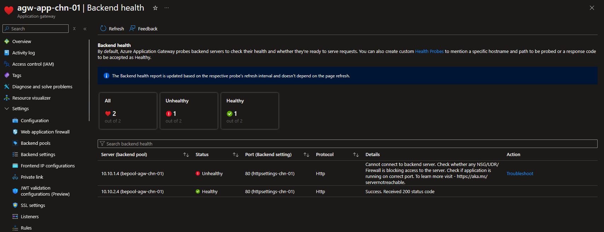

**CLI:**
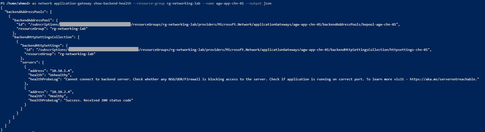

| Target | Status | Reason |
|---|---|---|
| `10.10.1.4` | Unhealthy | Still blocked by `nsg-app-chn-01` (Deny-All-Other-Inbound on port 80) — intended NSG behavior from Step 3, left in place |
| `10.10.2.4` | **Healthy** | NSG removed, outbound access restored, nginx responding — `200 OK` |

This confirms end-to-end that Application Gateway's health probe accurately reflects real network and application state — and that "Unhealthy" can stem from multiple independent layers (compute, host firewall, NSG, subnet-level outbound policy) that must be diagnosed systematically rather than assumed.

## 6. Teardown (cost control)

All resources created during the base deployment and the deep dive were removed in one pass:

```bash
az vm delete --resource-group rg-networking-lab --name vm-db-demo --yes --no-wait
az vm delete --resource-group rg-networking-lab --name vm-web-demo --yes --no-wait

az network nic ip-config update \
  --resource-group rg-networking-lab \
  --nic-name nic-db-demo-chn-01 \
  --name Ipv4config \
  --remove publicIPAddress

az network public-ip delete --resource-group rg-networking-lab --name pip-vm-db-demo-temp

az network application-gateway delete --resource-group rg-networking-lab --name agw-app-chn-01
az network public-ip delete --resource-group rg-networking-lab --name pip-agw-app-chn-01
```

## Key Learnings
- Application Gateway V1 is retired (April 28, 2026) — Standard_v2 / WAF_v2 are the only deployable SKUs
- Application Gateway requires a dedicated subnet with no other resource types
- Application Gateway's backend pool accepts raw IP addresses directly, unlike Standard Load Balancer's VM-centric Portal picker
- Standard_v2 routing rules require explicit **priority** and a named **listener**, structural fields absent in the retired v1 SKU
- **New Azure VNets (created after March 31, 2026) default subnets to private — no implicit outbound internet access.** This affects every VM in this lab retroactively and is the reason Step 10 (NAT Gateway) is not optional infrastructure but a functional requirement for any VM needing outbound access
- An NSG can be silently attached to more than one subnet — always verify actual attachment via `az network vnet subnet show` rather than assuming based on original design intent
- Azure CLI does not clear an assigned resource property with an empty string; use `--remove <propertyName>` instead
- Backend health failures can stem from multiple independent, stacked root causes (host firewall, NSG, subnet outbound policy) — systematic diagnosis from the VM outward (local test -> host firewall -> NSG effective rules -> gateway config) is more reliable than guessing based on a single symptom