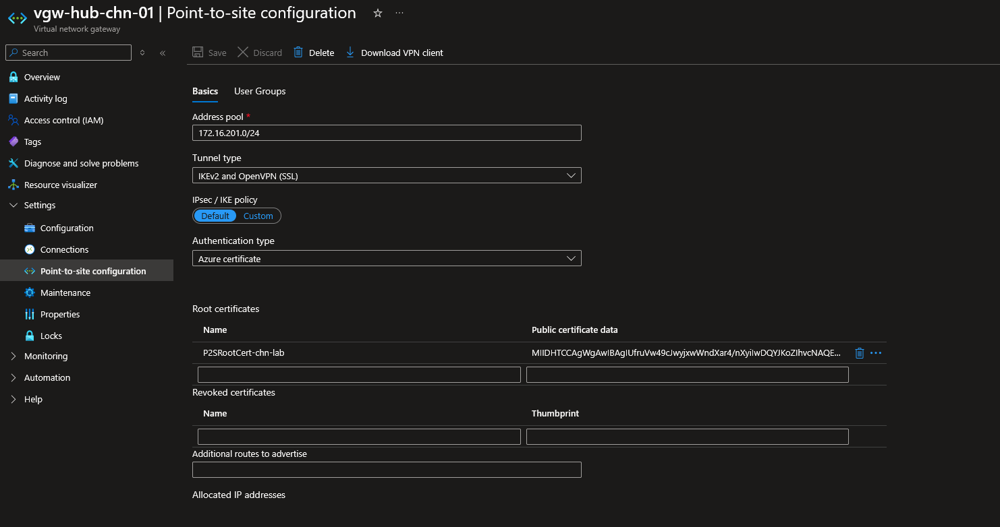
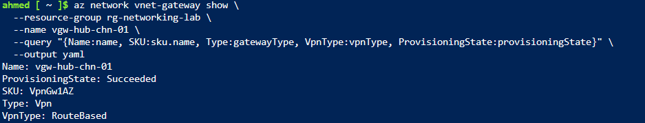
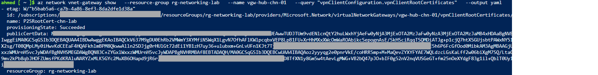

# Step 8: VPN Gateway

## Overview
This step deploys a route-based VPN Gateway configured for Point-to-Site (P2S) certificate authentication, using the pre-reserved `GatewaySubnet` from Step 1. This was the single most expensive and time-consuming resource in the lab — deployed, verified, and deleted within one extended session due to its ~45-minute provisioning time.

## Core Concept

VPN Gateway creates an encrypted IPsec/IKE tunnel between an Azure VNet and something outside Azure, over the public internet.

- **Site-to-Site (S2S)**: connects an entire on-premises network to Azure via a VPN device
- **Point-to-Site (P2S)**: connects an individual client machine directly to the VNet — used here to demonstrate the mechanism without needing a second physical network
- **Gateway SKU** (`VpnGw1AZ` through `VpnGw5AZ`) determines throughput, tunnel count, and BGP support. As of May 2025, Microsoft recommends AZ-suffixed SKUs universally, regardless of whether the deployment region physically supports availability zones
- **GatewaySubnet**: a dedicated, reserved subnet requirement (like Application Gateway's dedicated subnet in Step 7) — already reserved in Step 1 (`10.10.4.0/27`), so no new subnet work was needed
- **NSGs are not supported on `GatewaySubnet`** — attaching one can cause the gateway to malfunction. This is consistent with the subnet being left unassociated with any NSG throughout the lab
- **Gateway transit**: once a VPN Gateway exists on the hub, the peering configuration (Step 2) could be updated to let the spoke VNet reach on-premises through the hub's gateway without needing its own — noted conceptually here, not reconfigured, to keep scope focused
- **Certificate-based P2S authentication**: a self-signed root certificate's public key is uploaded to the gateway and trusted for client authentication; individual client certificates (generated from that root) would be installed per device for actual connections — not performed here, since proving the gateway/certificate trust configuration was the goal, not establishing a live client tunnel

## 1. Generate Root Certificate

```bash
openssl genrsa -out P2SRoot.key 2048
openssl req -x509 -new -nodes -key P2SRoot.key -sha256 -days 365 -out P2SRoot.crt -subj "/CN=P2SRootCert-chn-lab"
openssl x509 -in P2SRoot.crt -outform der | base64 -w 0 > P2SRoot_base64.txt
```

> 💡 A self-signed certificate is sufficient for lab/demo purposes. Production environments typically use a certificate from an internal PKI or trusted enterprise CA.

## 2. Create the VPN Gateway

**Portal:** Virtual network gateway -> + Create
- **Basics:** Name `vgw-hub-chn-01`, Region Switzerland North, Gateway type **VPN**, VPN type **Route-based**, SKU **VpnGw1AZ**, Generation **Generation 2**, VNet `vnet-hub-prod-chn-01` (auto-detected the existing `GatewaySubnet`)
- **Public IP (created inline within this same wizard):** Name `pip-vgw-hub-chn-01`, Availability zone **Zone-redundant**, active-active **Disabled**, BGP **Disabled**, Key Vault Access **Disabled**

**CLI:**
```bash
az network public-ip create \
  --resource-group rg-networking-lab \
  --name pip-vgw-hub-chn-01 \
  --sku Standard \
  --allocation-method Static \
  --zone 1 2 3 \
  --location switzerlandnorth

az network vnet-gateway create \
  --resource-group rg-networking-lab \
  --name vgw-hub-chn-01 \
  --location switzerlandnorth \
  --vnet vnet-hub-prod-chn-01 \
  --public-ip-addresses pip-vgw-hub-chn-01 \
  --gateway-type Vpn \
  --vpn-type RouteBased \
  --sku VpnGw1AZ \
  --generation Generation2 \
  --no-wait
```

Provisioning took approximately 45 minutes, polled periodically:
```bash
az network vnet-gateway show \
  --resource-group rg-networking-lab \
  --name vgw-hub-chn-01 \
  --query "provisioningState" \
  --output tsv
```


## 3. Configure Point-to-Site (separate step, post-gateway-creation)

**Portal:** `vgw-hub-chn-01` -> Point-to-site configuration -> Configure now
- Address pool: `172.16.201.0/24`
- Tunnel type: `IKEv2 and OpenVPN (SSL)`
- Authentication type: `Azure certificate`
- Root certificate: pasted `P2SRoot_base64.txt` contents, named `P2SRootCert-chn-lab`



**CLI:**
```bash
az network vnet-gateway update \
  --resource-group rg-networking-lab \
  --name vgw-hub-chn-01 \
  --address-prefixes 172.16.201.0/24 \
  --client-protocol OpenVPN

az network vnet-gateway root-cert create \
  --resource-group rg-networking-lab \
  --gateway-name vgw-hub-chn-01 \
  --name P2SRootCert-chn-lab \
  --public-cert-data "$(cat P2SRoot_base64.txt)"
```

> 💡 `172.16.201.0/24` was chosen as the P2S client address pool deliberately non-overlapping with `10.10.0.0/16` (hub) and `10.20.0.0/16` (spoke) from Steps 1–2 — the same address-planning discipline established at the start of the lab.

## 4. Verification

```bash
az network vnet-gateway show \
  --resource-group rg-networking-lab \
  --name vgw-hub-chn-01 \
  --query "{Name:name, SKU:sku.name, Type:gatewayType, VpnType:vpnType, ProvisioningState:provisioningState}" \
  --output yaml
```


Root certificate confirmation:
```bash
az network vnet-gateway show \
  --resource-group rg-networking-lab \
  --name vgw-hub-chn-01 \
  --query "vpnClientConfiguration.vpnClientRootCertificates" \
  --output table
```


Confirmed: `P2SRootCert-chn-lab`, `ProvisioningState: Succeeded`, full public certificate data present.

## 5. Teardown (critical — highest-cost step in the lab)

```bash
az network vnet-gateway delete --resource-group rg-networking-lab --name vgw-hub-chn-01
az network public-ip delete --resource-group rg-networking-lab --name pip-vgw-hub-chn-01
```

> 💡 Gateway deletion itself takes several minutes and is still billed time — the step isn't complete until deletion finishes, not just when the delete command is issued.

## Errors Encountered & Resolved

**1. Portal Public IP creation conflict:** Attempting "Use existing" showed no available Public IPs, while "Create new" with the intended name failed with *"There is already a resource with the same name and type within the current resource group."*
**Root cause:** A Public IP with that name already existed from an earlier attempt, but with a SKU/configuration (non-zone-redundant) incompatible with the AZ-series gateway SKU, so it didn't appear as a valid "existing" option.
**Resolution:** Deleted the conflicting Public IP and recreated it explicitly with the correct Standard SKU and zone redundancy before retrying gateway creation.

**2. Outdated documentation assumptions about the creation flow:** The originally planned sequence (pre-create a standalone Public IP, then a separate later step for P2S) reflected an older Portal/tutorial version.
**Resolution:** Verified against current Microsoft Learn documentation — the Public IP is now created inline within the gateway creation wizard itself, and Point-to-Site configuration is a distinct step performed only after the gateway finishes provisioning, via its own "Point-to-site configuration" page.

## Key Learnings
- VPN Gateway provisioning takes ~45 minutes regardless of SKU — this cannot be optimized around, unlike every other resource in this lab, and must be planned as a dedicated single-sitting session
- NSGs cannot be attached to `GatewaySubnet` — consistent with how the subnet was left unassociated since Step 1
- As of May 2025, AZ-suffixed gateway SKUs (e.g. `VpnGw1AZ`) are the universal recommendation regardless of regional availability zone support
- Azure documentation and Portal wizards evolve — always verify the current flow against official docs rather than assuming a previously-known sequence still applies, especially for less frequently used resources like VPN Gateway
- A Public IP with an incompatible SKU/zone configuration can silently fail to appear under "Use existing" in the Portal, producing a confusing pair of errors (not found vs. already exists) that are really the same underlying naming conflict
- Point-to-Site certificate authentication only requires the root certificate's public key to be trusted by the gateway — the private key never leaves the machine that generated it, and individual client certificates (not created in this lab) would be needed for an actual live connection