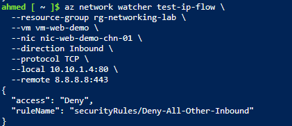
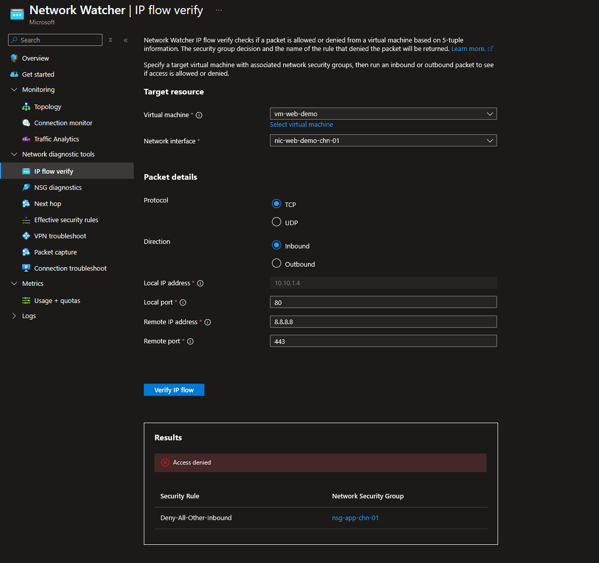
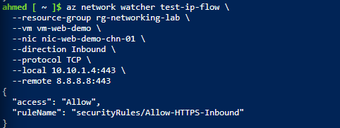
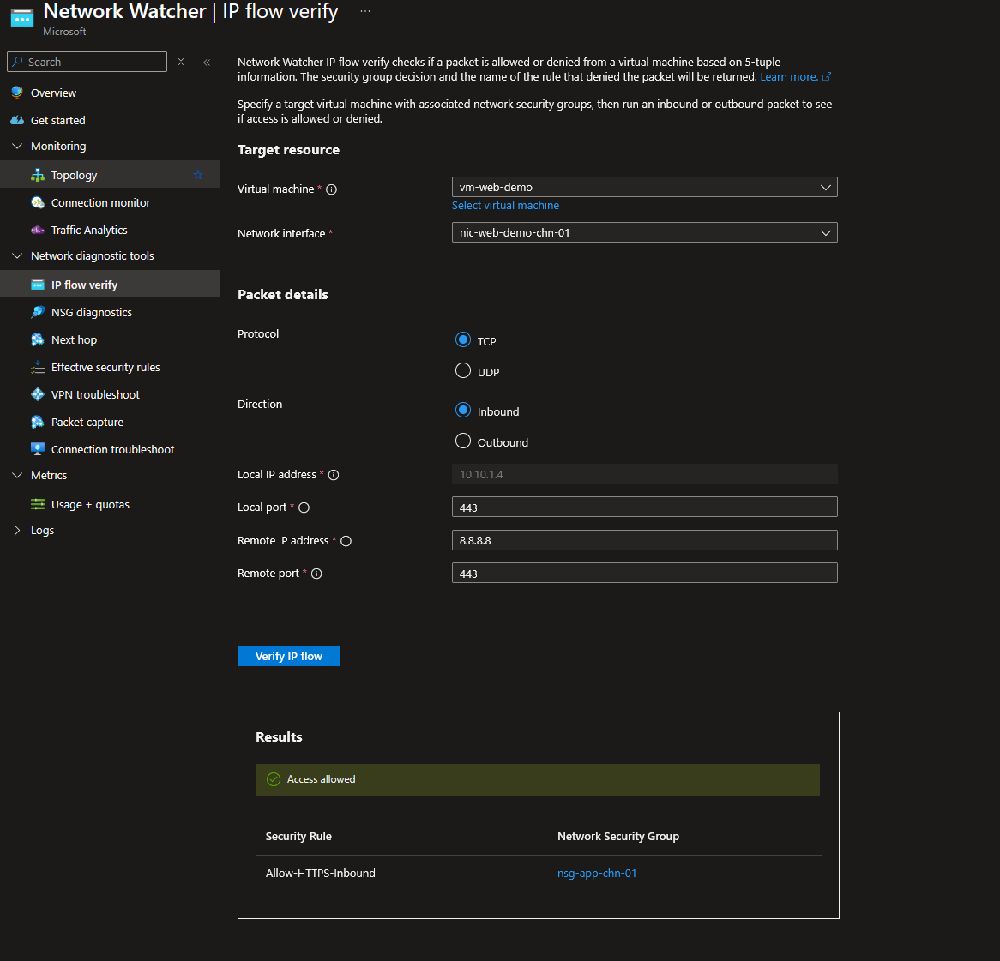
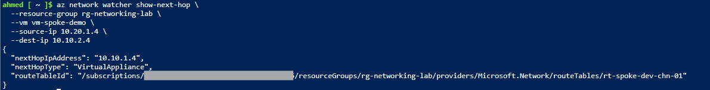
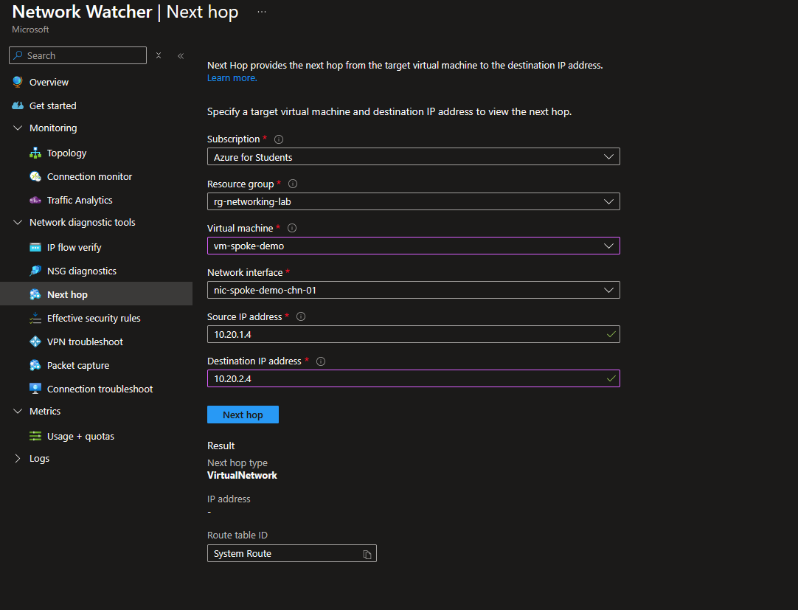
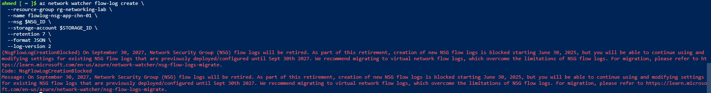
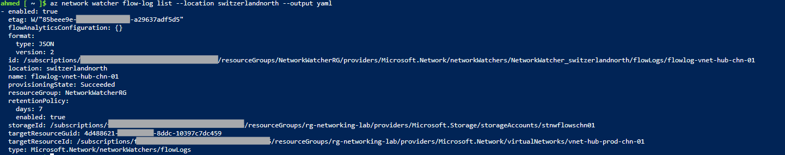
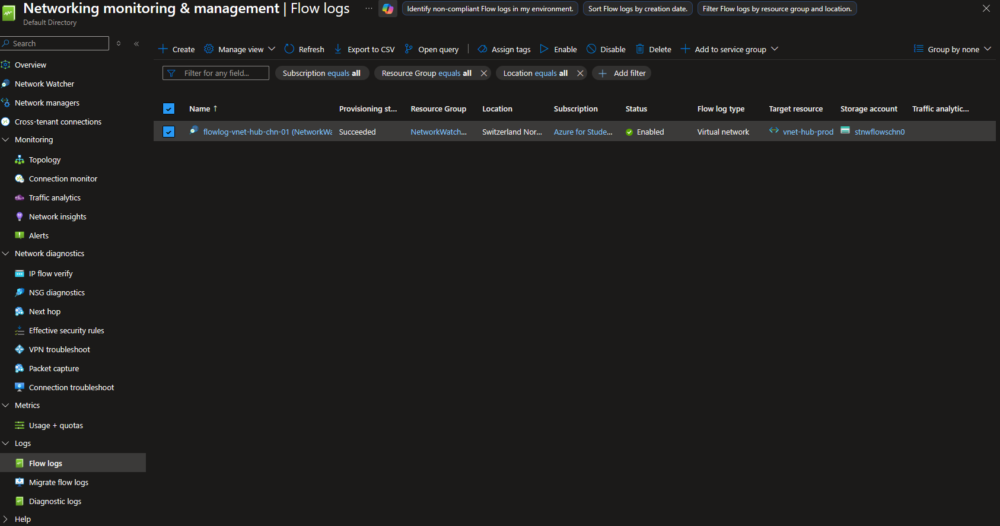

# Step 9: Network Watcher & Diagnostics

## Overview
This step uses Azure Network Watcher to formally validate the NSG rules (Step 3) and route table (Step 4) built earlier in the lab, using IP Flow Verify and Next Hop diagnostics. Along the way, Network Watcher surfaced a real, previously undetected configuration drift issue, and NSG Flow Logs turned out to be a retired feature requiring migration to Virtual Network Flow Logs.

## Core Concept

Network Watcher is Azure's built-in network monitoring and diagnostics service — it observes and tests existing infrastructure rather than carrying traffic itself.

Key tools used in this step:
- **IP Flow Verify**: evaluates whether traffic from a given source to destination on a specific port would be allowed or denied, based on actual effective NSG rules — without generating real traffic
- **Next Hop**: reports the actual routing decision Azure would make for traffic from a specific source to a specific destination — a targeted, single-path version of the effective routes table used in Step 4
- **NSG Flow Logs / Virtual Network Flow Logs**: capture actual allowed/denied traffic over time for audit and forensic purposes — directly relevant to the SC-200 track, since Microsoft Sentinel ingests these for threat detection

**⚠️ NSG Flow Logs retirement:** Creation of new NSG Flow Logs has been blocked since June 30, 2025, ahead of full retirement on September 30, 2027. Microsoft's recommended replacement is **Virtual Network Flow Logs**, which log traffic across an entire VNet rather than being scoped to a single NSG — a broader and architecturally cleaner capability.

Both IP Flow Verify and Next Hop require a NIC to be attached to a **running VM** — consistent with the pattern already seen in Step 4 (effective routes) and Step 7 (backend health): several Network Watcher diagnostics need live compute context, not just a standalone NIC.

## 1. IP Flow Verify — Validating Step 3's NSG Rules

Two temporary VMs were deployed onto existing demo NICs to provide the VM context required by these diagnostics.

```bash
az vm create \
  --resource-group rg-networking-lab \
  --name vm-web-demo \
  --nics nic-web-demo-chn-01 \
  --image Ubuntu2204 \
  --size Standard_B2ats_v2 \
  --admin-username azureuser \
  --generate-ssh-keys
```

**Test 1 — Port 80 (expected: Deny, per `Deny-All-Other-Inbound`):**
```bash
az network watcher test-ip-flow \
  --resource-group rg-networking-lab \
  --vm vm-web-demo \
  --nic nic-web-demo-chn-01 \
  --direction Inbound \
  --protocol TCP \
  --local 10.10.1.4:80 \
  --remote 8.8.8.8:443
```



**Test 2 — Port 443 (expected: Allow, per `Allow-HTTPS-Inbound`):**
```bash
az network watcher test-ip-flow \
  --resource-group rg-networking-lab \
  --vm vm-web-demo \
  --nic nic-web-demo-chn-01 \
  --direction Inbound \
  --protocol TCP \
  --local 10.10.1.4:443 \
  --remote 8.8.8.8:443
```



## Error Encountered & Resolved: NSG Configuration Drift

The first IP Flow Verify attempt returned:
```
(NsgsNotAppliedOnNic) No NSG applied on nic to allow or block traffic
```

**Investigation:** Direct inspection confirmed this was accurate, not a caching issue — `az network vnet subnet show` on `snet-app-chn-01` returned no `networkSecurityGroup` property at all, and `az network nic list-effective-nsg` showed only Azure's built-in default rules, with none of the four custom rules built in Step 3.

**Root cause:** `nsg-app-chn-01` had become detached from `snet-app-chn-01` at some point after Step 3 — most likely during the Step 7 investigation, where a `--remove networkSecurityGroup` command was used to fix a *different* subnet's misattachment (`snet-data-chn-01`). The NSG object and all four rules remained fully intact; only the subnet association was missing.

**Resolution:**
```bash
az network vnet subnet update \
  --resource-group rg-networking-lab \
  --vnet-name vnet-hub-prod-chn-01 \
  --name snet-app-chn-01 \
  --network-security-group nsg-app-chn-01
```

Confirmed via effective NSG rules, which then correctly showed all four custom rules alongside the defaults. Re-running IP Flow Verify then returned the expected results (Deny on port 80, Allow on port 443).

> 💡 **Technical Know-How:** Network Watcher's IP Flow Verify doesn't just simulate rule logic — it queries actual live configuration. When it reports no NSG applied, that reflects genuine current state, not a stale cache. This made it an effective, independent auditing tool that caught real drift the manual verification steps in Step 3 and Step 7 had missed.

## 2. Next Hop — Validating Step 4's Route Table

```bash
az vm create \
  --resource-group rg-networking-lab \
  --name vm-spoke-demo \
  --nics nic-spoke-demo-chn-01 \
  --image Ubuntu2204 \
  --size Standard_B2ats_v2 \
  --admin-username azureuser \
  --generate-ssh-keys

az network watcher show-next-hop \
  --resource-group rg-networking-lab \
  --vm vm-spoke-demo \
  --source-ip 10.20.1.4 \
  --dest-ip 10.10.2.4
```



Result confirmed: next hop type **VirtualAppliance**, next hop IP `10.10.1.4` — matching the custom UDR (`route-to-hub-via-nva`) configured in Step 4.

## 3. Flow Logs — NSG Flow Logs Retired, Migrated to VNet Flow Logs

Initial attempt to create an NSG Flow Log failed:
```
(NsgFlowLogCreationBlocked) On September 30, 2027, Network Security Group (NSG) flow logs will be retired. 
Creation of new NSG flow logs is blocked starting June 30, 2025...
```


**Resolution:** Used the current recommended replacement, **Virtual Network Flow Logs**, which use the same `az network watcher flow-log create` command but target a VNet (`--vnet`) instead of an NSG (`--nsg`).

```bash
az storage account create \
  --resource-group rg-networking-lab \
  --name stnwflowschn01 \
  --location switzerlandnorth \
  --sku Standard_LRS \
  --kind StorageV2

VNET_ID=$(az network vnet show \
  --resource-group rg-networking-lab \
  --name vnet-hub-prod-chn-01 \
  --query id -o tsv)

STORAGE_ID=$(az storage account show \
  --resource-group rg-networking-lab \
  --name stnwflowschn01 \
  --query id -o tsv)

az network watcher flow-log create \
  --location switzerlandnorth \
  --name flowlog-vnet-hub-chn-01 \
  --vnet $VNET_ID \
  --storage-account $STORAGE_ID \
  --retention 7 \
  --format JSON \
  --log-version 2
```

> 💡 **Technical Know-How:** The `--vnet` parameter requires a full resource ID rather than just a name, since flow log resources are created in the auto-managed `NetworkWatcherRG` resource group, not the lab's own resource group — Azure CLI cannot infer the source resource group by name alone in this cross-resource-group context.

**Verification:**
```bash
az network watcher flow-log list --location switzerlandnorth --output table
```



## 4. Teardown

```bash
az vm delete --resource-group rg-networking-lab --name vm-web-demo --yes --no-wait
az vm delete --resource-group rg-networking-lab --name vm-spoke-demo --yes --no-wait
```

OS disks confirmed and removed after VM deletion completed (per the Step 7 lesson on orphaned resources):
```bash
az disk list --resource-group rg-networking-lab --query "[].name" --output table
```

## Key Learnings
- IP Flow Verify and Next Hop both require a NIC to be attached to a running VM — the same live-compute requirement pattern seen in Step 4 (effective routes) and Step 7 (backend health)
- Network Watcher diagnostics reflect genuine live configuration, not cached state — when IP Flow Verify reported "no NSG applied," that was accurate and caught real configuration drift introduced earlier in the lab (during Step 7's NSG troubleshooting)
- NSG Flow Logs are retired for new deployments (blocked since June 30, 2025; full retirement September 30, 2027) — **Virtual Network Flow Logs** are the current supported path and log at the VNet level rather than being scoped to a single NSG
- The `--vnet` parameter in flow-log commands requires a full resource ID, not a bare name, since the flow log resource is created in `NetworkWatcherRG`, separate from the source VNet's resource group
- Formal diagnostic tools (Network Watcher) are a valuable independent check against manually-verified configuration — this step caught a real regression that had gone undetected since Step 7's own troubleshooting session