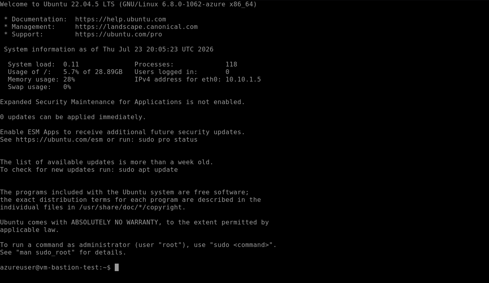
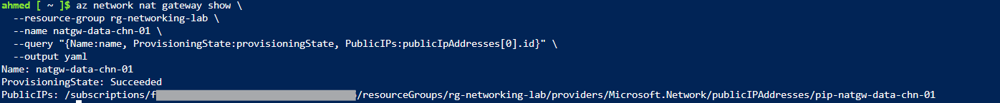
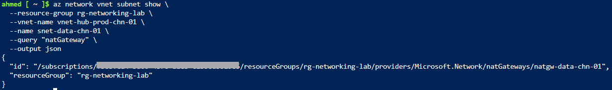
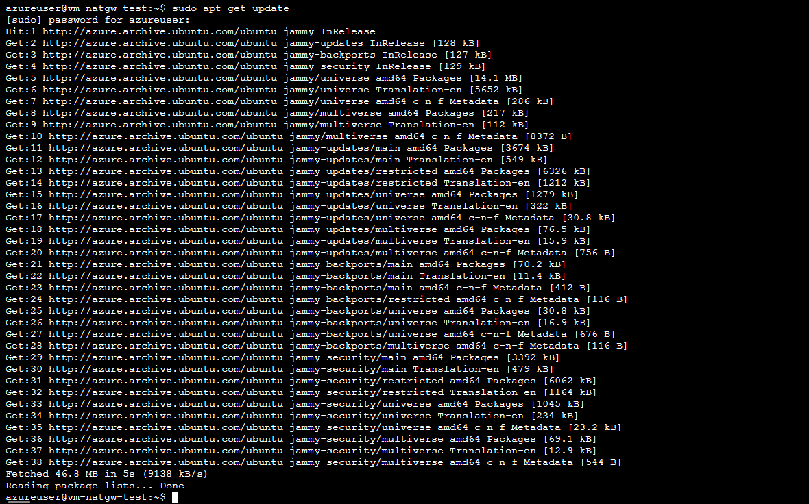

# Step 10: Azure Bastion & NAT Gateway

## Overview
This step covers two distinct but complementary services: Azure Bastion (secure VM access without public IP exposure) and NAT Gateway (subnet-level outbound internet access). NAT Gateway directly resolves the root cause discovered during Step 7's investigation — new Azure VNets have no default outbound internet access, and NAT Gateway is the production-correct fix, replacing the temporary per-NIC Public IP workaround used back then.

## Core Concept

**Azure Bastion** provides secure RDP/SSH access to VMs without exposing a public IP or opening inbound ports on the VM itself. Connections route through the Portal over HTTPS to a managed jump-host, which relays the session to the VM's private IP internally.

SKU tiers:
- **Developer**: free, zero-configuration, shared Microsoft-managed infrastructure, one VM connection at a time, **no dedicated subnet required**, does not support VNet peering (can only reach VMs in the same VNet it's tied to)
- **Basic/Standard/Premium**: dedicated deployment into the customer's VNet, requires the reserved `AzureBastionSubnet` (established in Step 1), billed hourly, supports multiple concurrent sessions and cross-VNet access via peering

Developer SKU was used for hands-on deployment in this step to keep cost at zero; Basic/Standard remains the production-relevant, exam-tested pattern and is documented conceptually below.

**NAT Gateway** provides scalable, subnet-level outbound-only internet connectivity:
- Attached at the **subnet level**, not per-NIC — every resource in that subnet automatically gains outbound access through it
- **Outbound-only** — does not accept inbound connections, unlike a Public IP directly on a NIC
- Uses a Standard SKU Public IP (or IP prefix) as its shared outbound address
- This is the correct, scalable fix for the default-outbound-access retirement discovered in Step 7, where a temporary per-NIC Public IP was used only to unblock that investigation

## 1. Azure Bastion — Developer SKU

A demo VM was deployed to test Bastion connectivity:

```bash
az vm create \
  --resource-group rg-networking-lab \
  --name vm-bastion-test \
  --vnet-name vnet-hub-prod-chn-01 \
  --subnet snet-app-chn-01 \
  --nsg "" \
  --image Ubuntu2204 \
  --size Standard_B2ats_v2 \
  --admin-username azureuser \
  --generate-ssh-keys
```

**Portal:** `vm-bastion-test` -> Connect -> Bastion tab -> **Deploy Bastion Developer** (top section of the page — distinct from the "Dedicated Deployment Options" section below it, which is the paid Basic/Standard path and was intentionally left untouched).

A VM password was set to allow Bastion authentication (SSH keys alone aren't usable through the Bastion password-auth flow):
```bash
az vm user update \
  --resource-group rg-networking-lab \
  --name vm-bastion-test \
  --username azureuser \
  --password "LabPass2026!"
```

Connected successfully via the Portal's Bastion Connect form (Authentication Type: VM Password), opening an SSH session in a new browser tab — no public IP was ever assigned to the VM, and no inbound NSG rule for port 22 was required.



> 💡 **Technical Know-How:** Bastion Developer SKU is region-limited but was significantly expanded (36 regions as of April 2025, including Switzerland North). It requires no `AzureBastionSubnet` and no dedicated Bastion resource — connectivity is provisioned automatically the moment a session is requested from a VM's Connect blade, and disappears automatically when unused.

### Conceptual note: Basic/Standard SKU (not deployed — cost-driven decision)

For reference, a production dedicated Bastion deployment would use:
```bash
az network bastion create \
  --resource-group rg-networking-lab \
  --name bastion-hub-chn-01 \
  --public-ip-address pip-bastion-chn-01 \
  --vnet-name vnet-hub-prod-chn-01 \
  --sku Basic \
  --location switzerlandnorth
```
This would deploy into the `AzureBastionSubnet` reserved in Step 1, cost roughly €0.19/hour, and support multiple simultaneous sessions plus access across peered VNets — the correct choice for a team environment, but unnecessary for this single-user lab.

## 2. NAT Gateway

### Create Public IP and NAT Gateway
```bash
az network public-ip create \
  --resource-group rg-networking-lab \
  --name pip-natgw-data-chn-01 \
  --sku Standard \
  --allocation-method Static \
  --location switzerlandnorth

az network nat gateway create \
  --resource-group rg-networking-lab \
  --name natgw-data-chn-01 \
  --public-ip-addresses pip-natgw-data-chn-01 \
  --location switzerlandnorth
```

### Attach to `snet-data-chn-01`
The exact subnet that failed to install nginx in Step 7 due to missing default outbound access.

```bash
az network vnet subnet update \
  --resource-group rg-networking-lab \
  --vnet-name vnet-hub-prod-chn-01 \
  --name snet-data-chn-01 \
  --nat-gateway natgw-data-chn-01
```

### Verification
```bash
az network nat gateway show \
  --resource-group rg-networking-lab \
  --name natgw-data-chn-01 \
  --query "{Name:name, ProvisioningState:provisioningState, PublicIPs:publicIpAddresses[0].id}" \
  --output yaml
```


```bash
az network vnet subnet show \
  --resource-group rg-networking-lab \
  --vnet-name vnet-hub-prod-chn-01 \
  --name snet-data-chn-01 \
  --query "natGateway" \
  --output json
```


Both confirmed: NAT Gateway provisioned successfully and correctly associated with the subnet.

### Proof of Fix — Outbound Connectivity Test

A VM was deployed on `nic-db-demo-chn-01` (the same NIC that failed outbound access in Step 7) with **no per-NIC Public IP this time** — relying entirely on the NAT Gateway for outbound access.

```bash
az vm create \
  --resource-group rg-networking-lab \
  --name vm-natgw-test \
  --nics nic-db-demo-chn-01 \
  --image Ubuntu2204 \
  --size Standard_B2ats_v2 \
  --admin-username azureuser \
  --generate-ssh-keys

az vm user update \
  --resource-group rg-networking-lab \
  --name vm-natgw-test \
  --username azureuser \
  --password "LabPass2026!"
```

Via Serial Console:
```bash
sudo apt-get update
```

Succeeded cleanly, with no `Unable to connect to azure.archive.ubuntu.com` timeout — directly confirming the NAT Gateway resolved the exact failure encountered in Step 7's investigation.



## 3. Teardown

```bash
az vm delete --resource-group rg-networking-lab --name vm-bastion-test --yes --no-wait
az vm delete --resource-group rg-networking-lab --name vm-natgw-test --yes --no-wait

az network vnet subnet update \
  --resource-group rg-networking-lab \
  --vnet-name vnet-hub-prod-chn-01 \
  --name snet-data-chn-01 \
  --remove natGateway

az network nat gateway delete --resource-group rg-networking-lab --name natgw-data-chn-01
az network public-ip delete --resource-group rg-networking-lab --name pip-natgw-data-chn-01
```

OS disks confirmed and removed after VM deletion completed, per the standing lesson from Step 7.

> 💡 Bastion Developer required no explicit teardown — it's shared Microsoft-managed infrastructure with no persistent billable resource created in the resource group.

## Key Learnings
- Bastion Developer SKU is free, requires no dedicated subnet, and is now available in 36 regions including Switzerland North — a strong fit for single-user dev/test labs, though it cannot span peered VNets and only supports one session at a time
- The `AzureBastionSubnet` reserved in Step 1 remains correctly provisioned for a future Basic/Standard SKU deployment, which would be the production choice for multi-user or cross-VNet access
- NAT Gateway is attached at the **subnet level**, giving every resource in that subnet outbound-only internet access without individual Public IPs — the scalable, secure replacement for the ad-hoc per-NIC Public IP workaround used in Step 7
- This step directly closed the loop on Step 7's investigation: the exact same NIC (`nic-db-demo-chn-01`) that previously failed `apt-get update` due to the default-outbound-access retirement succeeded cleanly once NAT Gateway was properly attached to its subnet
- Bastion and NAT Gateway solve opposite halves of the same security principle: Bastion enables secure **inbound** management access without exposing VMs directly, while NAT Gateway enables safe **outbound** internet access without exposing VMs to inbound connections — together they eliminate the need for any Public IP on individual workload VMs